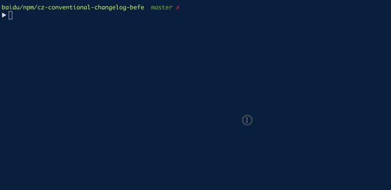

# cz-conventional-changelog-befe

cz-conventional-changelog-befe 是为 BEFE 团队定制的 [commitizen 适配器](https://github.com/commitizen/cz-cli#adapters).

可以通过友好交互(问答式)提交符合[规范的 commit message](https://www.conventionalcommits.org/).

主要特性:

- 关联多张 icafe 卡片, 自动补全 icafe card 前缀
- 生成 BEFE 团队风格的 commit message
- 友好问答
- icafe suggest
- 记录上次的交互输入值

## 主流规范 vs BEFE 规范

```bash
# types is BEFE's standard
<type>(<scope>): <subject>

<body>

<footer>
```

### 主要区别

- types: 是 BEFE 团队定制的 types from [conventional-commit-types-befe](http://gitlab.baidu.com/be-fe/conventional-commit-types-befe)
- issues: 提示输入 icafe card ID, 会自动补全前缀
- 简要描述和关联卡片输入框 支持 icafe suggest  
  (如输入 '#{关键字(可以是 id 或者 title 等等)}' 或者 带有明确 icafe spaceId，如 'icafe-api-{关键字}')
- 支持输入值交互的保存（详见[inquirer-store](https://github.com/imcuttle/inquirer-store)）  
  使用 `git cz --read` 来使得上一次保存值生效



**生成的 commit message 示例**

```text
feat(邮件模块): 富文本输入框添加变量的 mention 功能

mention 功能并未使用第三方库

fix hcm-123,hcm-234,hcm-345
```

## 问题顺序

- **type** (_required_)
  Select the type of change that you're committing
- **scope** (_optional_)
  Denote the scope of this change ($location, $browser, $compile, etc.)
- **subject** (_required_)
  Write a short, imperative tense description of the change
- **body** (_optional_)
  Provide a longer description of the change
- **footer** (_optional_)
  - **breaking changes** (_optional_)
    List any breaking changes
  - **issues** (_optional_)
    List any issues closed by this change

## 安装

```bash
npm install commitizen cz-conventional-changelog-befe
```

同时推荐 `npm install -g commitizen`
全局注入了 `git cz`，用来引导式书写规范的 commit message，十分适合于不熟悉的同学。

- `git cz --retry`：跳过问答式交互，直接以上一次的提交 message 进行提交
- `git cz --read`: 使用 `git cz --read` 来使得上一次交互输入值生效

## 使用

在 `package.json` 中书写：
**要把注释删掉哦**

```javascript
{
  "lang": "en", // 默认为 `zh`
  "icafe": {
    "spaceId": "" // 非必填，icafe 的空间标识，不填则关闭 icafe suggest 和补全功能。如 "befe-erp"
  },
  "config": {
    "commitizen": {
      "path": "./node_modules/cz-conventional-changelog-befe"
    },
    "cz-conventional-changelog-befe": {
      // 配置在这写
    }
  },
  "scripts": {
    "commit": "git-cz"
  }
}
```

### 配置说明

其中的 `icafe` 字段用来设置 icafe-suggest 功能的参数值

参数值的接受规则请看 [icafe-api](http://gitlab.baidu.com/be-fe/icafe-api#%E5%A6%82%E4%BD%95%E8%AE%BE%E7%BD%AE%E7%94%A8%E6%88%B7%E5%90%8D%E5%AF%86%E7%A0%81%E7%AD%89%E9%BB%98%E8%AE%A4%E5%8F%82%E6%95%B0)

#### `iql`

其中关于 `iql` 说明请看 [API: 获取满足条件的卡片:根据一定的过滤条件查询满足条件的相关所有卡片以及卡片的详细信息](http://wiki.baidu.com/pages/viewpage.action?pageId=457513331)

默认值为 `'负责人 in (currentUser)'`

> `iql`: 查询条件，需求池高级查询语句，用于对卡片进行按条件筛选。

> 如流程状态 = closed AND 优先级 > 3。

> 如果不会使用，可以去对应 icafe 的空间的需求池里面，点击“高级查询”按钮，

> 会有一个自动 suggest 提示你书写 iql 的文本框，写完后点击查询可以检验自己写的是否正确

#### `suggestPlaceholder`

该字段用来配置 icafe suggest 条目展示规则

如默认为 `'#{sequence?link} [{type?align=center}] ({status?align=center}) {title?w=35%} {responsiblePeople?w=10%}'` 对应展示如下图：


其中支持的数据字段在 [placeholder.data.json](./__tests__/fixture/icode.json)

其中的 `title?link` 表示传参 `link`，支持的传参有：

| 参数    | 说明                                                                                                                     | 类型                                |
| ------- | ------------------------------------------------------------------------------------------------------------------------ | ----------------------------------- |
| `link`  | 是否在该字段上显示使用超链接（ Cmd + 左键 跳转至 icafe ）, 当命令行宽度大于 140 时，该功能才开启；小于时候有文本换行 bug | `boolean`                           |
| `w`     | 该字段的最大宽度大小，超出用 '...' 结尾，如 `30%` 或者 `100`                                                             | `number|string`                     |
| `align` | 该字段的水平对齐规则                                                                                                     | `'left'` OR `'right'` OR `'center'` |

#### `isDesc`

是否降序

- Type: `boolean`
- Default: `false`

#### `order`

按照什么排序，详细情况 icafe 支持字段

- Type: `string`
- Default: `'createTime'`

#### `scopes`

自定义 scopes，如果需要自定义项目的可选 scopes，使用该字段

- Type: `Array`
- Default: `null`
- Examples

```javascript
// name：表示显示值；value：表示输出值
;['编辑页面', '保存页面', { name: '无', value: '' }]
```

#### `scopeSuggestOnly`

对应自定义 scope，是否只是自动补全交互。“是”表示允许用户随意输入 scope，否则只能在 `scopes` 中选择固定 scope

- Type: `boolean`
- Default: `false`

### `icafe-api` 参数配置

根据 [icafe-api](http://gitlab.baidu.com/be-fe/icafe-api#%E5%A6%82%E4%BD%95%E8%AE%BE%E7%BD%AE%E7%94%A8%E6%88%B7%E5%90%8D%E5%AF%86%E7%A0%81%E7%AD%89%E9%BB%98%E8%AE%A4%E5%8F%82%E6%95%B0) 的参数获取规则，

建议将 `password` 以系统环境变量形式存储 `export ICAFE_PASSWORD=foo;`

其中 icafe 用户名和密码, 在 http://icafe.baidu.com/users/virtual 中查看.

**注意: 上述网站中的密码不能直接使用,需要经过 `decodeURIComponent('password')` 后, 才能赋值使用**

`username` 则在项目目录下设置 `git config user.name "Your Name Here"`，一般 icode 推荐的 clone repo 方式会自动注入用户名至 git 配置

之后通过 `git config --local user.name` 查看是否已经配置用户名在当前 git 目录

## Debug

```bash
# 只调试 cz
DEBUG=cz-conventional-changelog-befe git cz

# icafe-api 调试也开启
DEBUG=cz-conventional-changelog-befe,icafe-api* git cz
```

## Example

```bash
node run-cz.js
```

## 样例项目

[icode commit-demo](http://icode.baidu.com/repos/baidu/personal-code/commit-demo)
